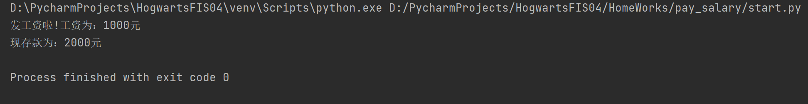

## 项目介绍
自动化训练营四期实战项目演练

## Quick Start

## 霍格沃兹测试学院
- 学员：kkk

##课后作业

---------------------------------------------
### 01 【发工资】

原有存款 1000元， 发工资之后存款变为2000元
定义模块
1、money.py saved_money = 1000
2、定义发工资模块 send_money，用来增加收入计算
3、定义工资查询模块 select_money，用来展示工资数额
4、定义一个start.py ，启动文件展示最终存款金额

- [作业地址](https://gitee.com/hogwarts-kkk/HogwartsFIS04/tree/master/HomeWorks/pay_salary)

运行结果

---------------------------------------------