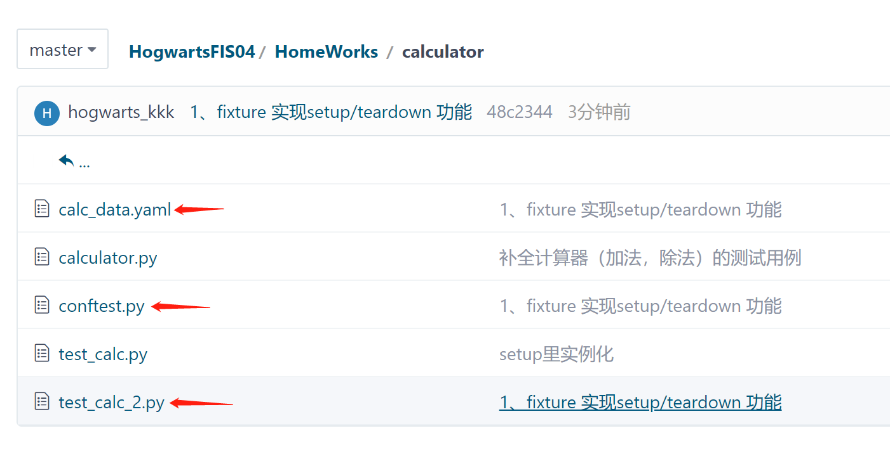

## 项目介绍
自动化训练营四期实战项目演练

## Quick Start

## 霍格沃兹测试学院
- 学员：kkk

## 课后作业

### python 脚本编写实战（01）
- 原有存款 1000元， 发工资之后存款变为2000元  
- 定义模块  
1、money.py saved_money = 1000  
2、定义发工资模块 send_money，用来增加收入计算  
3、定义工资查询模块 select_money，用来展示工资数额  
4、定义一个start.py ，启动文件展示最终存款金额  
（import 导包 类似浅拷贝的二层 拷贝地址）

- 知识要点：  
1.浅拷贝与深拷贝：  
  浅拷贝：[2]只拷贝[1]的第一层并赋予新的地址，更深层指向[1]的地址  
  深拷贝：[2]拷贝[1]完全赋予新的内存地址，[1]的改变对[2]没有作用
  
  2.import 与 from import  
import 相当于浅拷贝  
from import 相当于深拷贝

- [作业地址](https://gitee.com/hogwarts-kkk/HogwartsFIS04/tree/master/HomeWorks/pay_salary)

- 运行结果

---------------------------------------------------------------------

### python 脚本编写实战（02）

- [需求](HomeWorks/class_animal/animal_needs.txt)
- 知识要点
1. 类的属性和行为
2. 类的构造方法（实例化时会进行调用）
3. 私有属性
4. 继承（初始化，super()，构造方法继承，父类方法重写）
5. self
6. yaml 存储测试数据 （ yaml.safe_load(),yaml.safe_dump() ）

- [作业地址](https://gitee.com/hogwarts-kkk/HogwartsFIS04/tree/master/HomeWorks/class_animal)

---------------------------------------------------------------------

### python pytest 测试实战（一）

- 需求  
1、补全计算器（加法，除法）的测试用例  
2、使用数据驱动完成测试用例的自动生成  
3、在调用测试方法之前打印【开始计算】，在调用测试方法之后打印【计算结束】   
  坑1:除数为0的情况  
坑2: 自己发现
  

- [作业地址](https://gitee.com/hogwarts-kkk/HogwartsFIS04/tree/master/HomeWorks/calculator)

---------------------------------------------------------------------
### python pytest 测试实战（二）
- 需求
  
  1、上节课的作业，使用fixture 实现setup/teardown 功能，  
2、实现 参数化的功能  
3、生成测试 报告

- 知识要点
  1. pytest fixture 作用
    - 定义传入测试中的数据集
     - 配置测试前系统的初始状态
     - 为批量测试提供数据源等
    - 使用：直接通过函数名，传递到方法中
  
  2. pytest conftest.py
  - 数据共享的地方（全局的配置和前期工作都可以写在这里）
  3. allure
  - 生成 allure 测试结果 ：pytest —alluredir=./report/ (例如：$ pytest test_calc_2.py --alluredir ./result)
  - 展示报告：allure serve ./report
  - 生成最终版本的报告： allure generate ./report

- [作业地址](https://gitee.com/hogwarts-kkk/HogwartsFIS04/tree/master/HomeWorks/calculator)

---------------------------------------------------------------------

### web 企业微信实战（一）

- 需求：使用序列化的方法用cookie登录企业微信
- 知识要点：
  - 使用chrome debug方式登录企业微信，复用浏览器 获取cookies 
  - 在新的测试用例中 获取cookies 传入driver 以致达到免扫码登录
  
- [作业地址](https://gitee.com/hogwarts-kkk/HogwartsFIS04/tree/master/HomeWorks/we_getcookies)