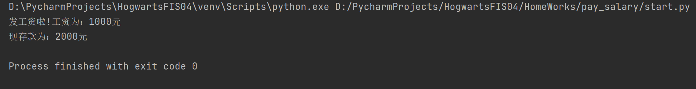

## 项目介绍
自动化训练营四期实战项目演练

## Quick Start

## 霍格沃兹测试学院
- 学员：kkk

## 课后作业

### python 脚本编写实战（01）
- 原有存款 1000元， 发工资之后存款变为2000元  
- 定义模块  
1、money.py saved_money = 1000  
2、定义发工资模块 send_money，用来增加收入计算  
3、定义工资查询模块 select_money，用来展示工资数额  
4、定义一个start.py ，启动文件展示最终存款金额
（import 导包 类似浅拷贝的二层 拷贝地址）

- 知识要点：  
1.浅拷贝与深拷贝：   
  浅拷贝：[2]只拷贝[1]的第一层并赋予新的地址，更深层指向[1]的地址  
  深拷贝：[2]拷贝[1]完全赋予新的内存地址，[1]的改变对[2]没有作用
  
2.import 与 from import
import 相当于浅拷贝
from import 相当于深拷贝

- [作业地址](https://gitee.com/hogwarts-kkk/HogwartsFIS04/tree/master/HomeWorks/pay_salary)

- 运行结果

---------------------------------------------------------------------